# j-pii + ocr-pi — guida utente (e di collaudo)

Due strumenti che lavorano insieme dentro l'agente **pi**:

- **j-pii** — il buttadifuori della privacy: maschera i dati sensibili prima che arrivino all'LLM e li ripristina nelle risposte. I valori veri non lasciano mai il tuo computer.
- **ocr-pi** — il convertitore di documenti: trasforma immagini e PDF in Markdown con tabelle (anche storte), li organizza in dizionari wiki consultabili, li espone all'agente (MCP + app web con dock) e chiede il permesso prima di ogni immagine (hook).

Questa guida spiega tutto in parole semplici. Il capitolo 8 è il tour dei
test guidato, scritto per chi legge dopo e vuole riverificare tutto.

---

## 1. Requisiti

- Node 22+, Python 3.11+, l'agente `pi` installato
- Spazio disco (~4 GB per i modelli, scaricati una volta sola)

## 2. Installazione (una volta sola)

```bash
# 1. Dipendenze dell'extension
cd extension && npm install && cd ..

# 2. Ambiente Python per OCR (solo CPU, niente GPU)
python3 -m venv ocr-pi/.venv
ocr-pi/.venv/bin/pip install docling pillow opencv-python-headless mcp pymupdf

# 3. Ambiente Python per la privacy + pesi modello (~1.2 GB)
python3 -m venv .venv
.venv/bin/pip install torch --index-url https://download.pytorch.org/whl/cpu
.venv/bin/pip install transformers flask pymupdf huggingface_hub
.venv/bin/hf download rizzoaiacademy/rizzo-pii-0.3B --revision v1.5.0 \
  --local-dir rizzo-pii/models/rizzo-pii-0.3B-v1.5.0

# 4. SDK per il dock web (solo per l'app)
cd ui && npm install && cd ..
```

I modelli OCR si scaricano da soli alla prima conversione. Pesi, venv,
PDF scaricati e report non finiscono mai nel repo (vedi `.gitignore`).

## 3. Avvio pi con tutto

```bash
JPII_ANALYZER=fake JPII_PYTHON=.venv/bin/python pi \
  --provider opencode --model muse-spark-1.3-contributor-free \
  -e ./extension/j-pii.ts -e ./extension/ocr-pi.ts
```

Con `JPII_ANALYZER=fake` si prova senza modello privacy (solo CF + email).
La prima conversione impiega ~2 minuti (carica i modelli), dalla seconda
in poi secondi (demone persistente, vedi 5.5).

---

## 4. j-pii: la privacy automatica

Non devi fare niente: ogni testo diretto all'LLM viaggia con segnaposto tipo
`[CF_1]`; in risposte e file scritti ritrovi i valori veri. Tre prove:

- **A (silenzioso):** `Codice fiscale RSSMRA80A01H501U: elenca il segnaposto che vedi.`
- **B (revisione umana):** `Riepiloga questo: Mario Rossi, codice fiscale RSSMRA80A01H501U`
  → per i casi dubbi compare `Mask it / Send in clear`; se ignori, blocca.
- **C (file scritti):** fai scrivere un file con un codice fiscale e verifica
  che su disco ci sia il valore vero.

Garanzie: mappa mai in rete, niente su disco, cancellata a fine sessione.
Qualsiasi errore blocca invece di far passare dati.

---

## 5. ocr-pi: convertire immagini e PDF

### 5.1 Le due domande (hook)

Quando alleghi un'immagine (trascinala, incollala, o citala con
`@/percorso/immagine.png` o col percorso scritto), prima che parta qualsiasi
cosa ti vengono fatte **due domande, una sola volta per sessione**:

1. **Usare l'OCR locale?** — Sì = converte in Markdown sul tuo computer
   (vedi un messaggio di attesa con nome file e tempi onesti).
   No = invia l'immagine originale al provider (con avviso).
2. **Contiene dati sensibili?** — Sì = testo mascherato via j-pii.
   No = testo in chiaro, ma solo per quel documento.

Se chiudi senza rispondere, o non c'è interfaccia, la richiesta viene
**bloccata**. File non validi vengono saltati con avviso chiaro
(`salto ... non è un'immagine valida`).

### 5.2 Dizionari wiki

Una wiki è una cartella con trascrizioni, indice, immagini e una `SKILL.md`
che dice all'agente quando usarla:

```bash
python3 ocr-pi/cli.py --root ~/wiki create fatture
python3 ocr-pi/cli.py --root ~/wiki add fatture documento.md --titolo Voce
python3 ocr-pi/cli.py --root ~/wiki search iva --stato draft
python3 ocr-pi/cli.py --root ~/wiki show fatture Voce
python3 ocr-pi/cli.py --root ~/wiki review fatture Voce reviewed
python3 ocr-pi/cli.py --root ~/wiki rename fatture Fatture-2026
python3 ocr-pi/cli.py --root ~/wiki export fatture [--senza-raw]
python3 ocr-pi/cli.py --root ~/wiki import fatture.zip [--merge]
python3 ocr-pi/cli.py --root ~/wiki remove fatture Voce   # cestino
python3 ocr-pi/cli.py --root ~/wiki remove fatture --confirm  # wiki intera
```

Regole d'oro: tutto nasce `draft`, si esporta solo `reviewed+`; cestino per
le voci, conferma per le wiki; import mai silenziosi. Aggiungi `--json` per
output macchina (lo usa il backend web).

### 5.3 MCP: gli stessi comandi, per l'agente

9 comandi (`ocr_convert`, `wiki_list/search/get/add/review/remove/export/import`).
L'agente converte e archivia da solo. Prova dal vivo:

```bash
ocr-pi/.venv/bin/python ocr-pi/server.py --root /tmp/mcptest --selftest
```

### 5.4 Anteprima singola: vedi prima di fidarti

```bash
python3 ocr-pi/preview.py --pdf scan.pdf --engine docling --wiki-root ~/wiki --slug demo --out prev-out
```

Originale e Markdown fianco a fianco, tabelle evidenziate, interruttore Mask,
review a tre stati (Draft/Reviewed/Versioned) collegata alla wiki (`--serve 8000` per i pulsanti).

### 5.5 Demone: la seconda conversione in secondi

Il primo OCR carica i modelli (~2 min); il demone li tiene in memoria per la
sessione (misurato: 137 s → 0.7 s). Vive e muore con la sessione; log in
`/tmp/ocr-pi-daemon.log`. Niente da configurare.

---

## 6. App web (PWA locale, anche da mobile)

### 6.1 Avvio

```bash
# dipendenze (una volta sola, vedi capitolo 2 punto 4)
cd ui && npm install && cd ..

# avvio base: wiki in ~/wiki, porta 8001
PORT=8001 UI_WIKI_ROOT=~/wiki node ui/server.mjs
# apri http://localhost:8001 — anche dal telefono in rete locale
# (es. http://192.168.1.10:8001, stessa Wi-Fi)
```

Variabili d'ambiente:

| Variabile | Default | Cosa fa |
|---|---|---|
| `PORT` | `8000` | porta d'ascolto (`PORT=8002 …` se occupata) |
| `UI_WIKI_ROOT` | `./wikis` | radice delle wiki e di `sources.json` |
| `UI_PYTHON` | `ocr-pi/.venv/bin/python` | python del demone OCR (`python3` per provare col motore `fake`) |
| `UI_MODEL` | `opencode/muse-spark-1.3-contributor-free` | modello del dock agente (mostrato nel badge in alto) |
| `JPII_ANALYZER` | `real` | `fake` = dock senza pesi modello (maschera solo CF/email via regex) |
| `JPII_PYTHON` | `python3` | interprete del sidecar j-pii (se manca e c'è `.venv/bin/python`, l'app lo usa da sola) |
| `UI_CHAT_TIMEOUT_MS` | `180000` | timeout risposta dock (3 min): poi azzera e lo scrive in chat |

Prova veloce senza modelli (motore `fake`): metti `UI_PYTHON=python3` e
scegli `fake` nel selettore motore prima di convertire.

### 6.2 Cosa trovi

Topbar (ricerca globale con filtro stato, tema chiaro/scuro, Nuova wiki,
Converti file), sidebar (cartelle sorgente con rimozione, wiki con stati,
originali `raw/` cliccabili, Cestino totale), split originale/convertito (anteprima mask locale, opzioni
motore/pagine/deskew, review a tre stati draft/reviewed/versioned, cestina
voce, file wiki `index.md`/`SKILL.md`/`meta.json`), menu wiki (nuova voce,
esporta completo/leggero, importa zip con merge, rinomina, vedi cestino,
elimina wiki con conferma), dock agente (nuova conversazione, OCR +
sensibili come toggle, motore/deskew, allegati multipli). Scorciatoia:
`Ctrl/⌘+K` porta il cursore nella ricerca globale.

V1 da browser (l'installazione PWA vuole HTTPS: più avanti).

### 6.3 Screenshot (dal tour Playwright, `python3 scripts/verify-ui.py`)

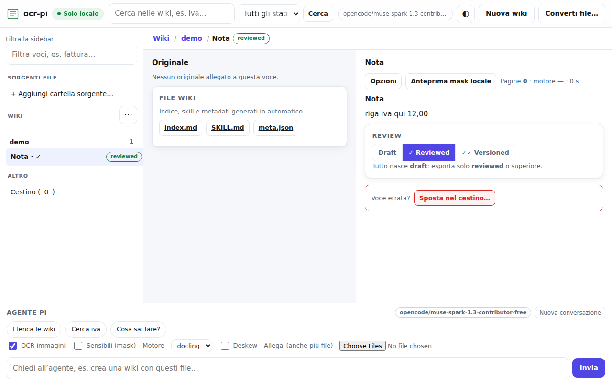
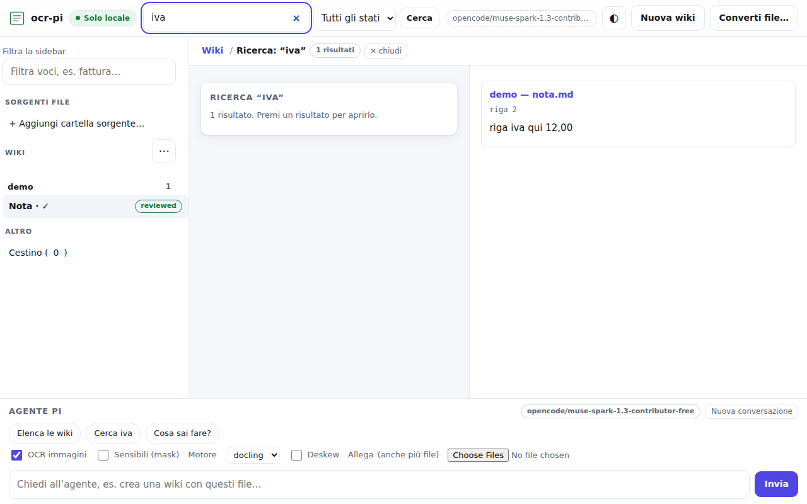
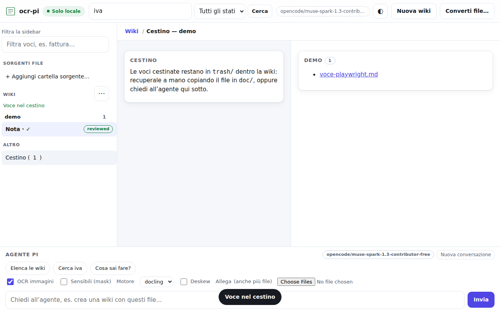
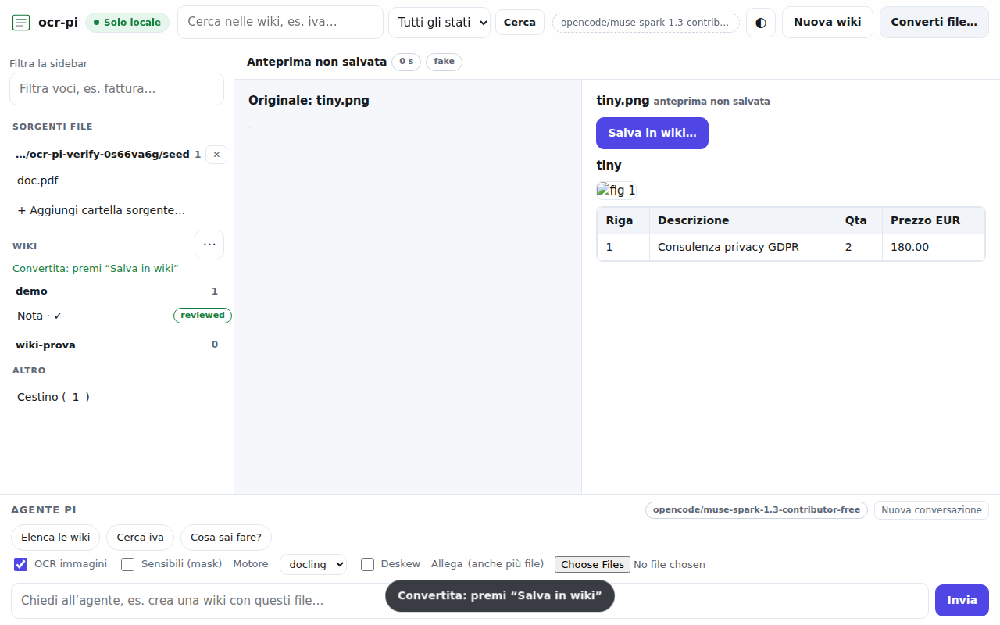
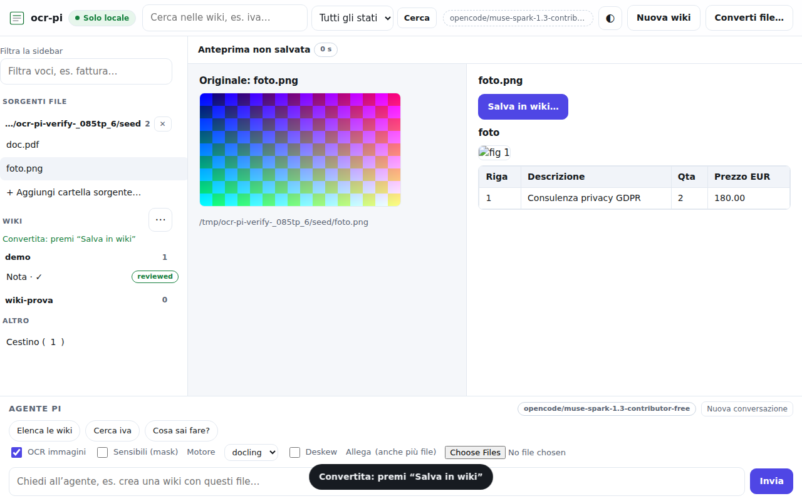
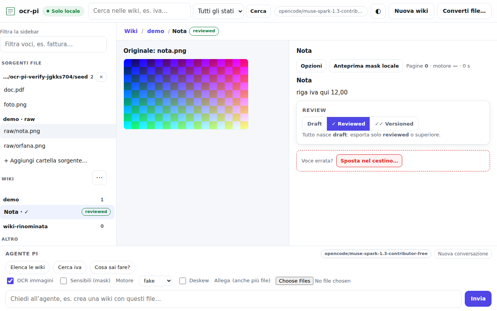
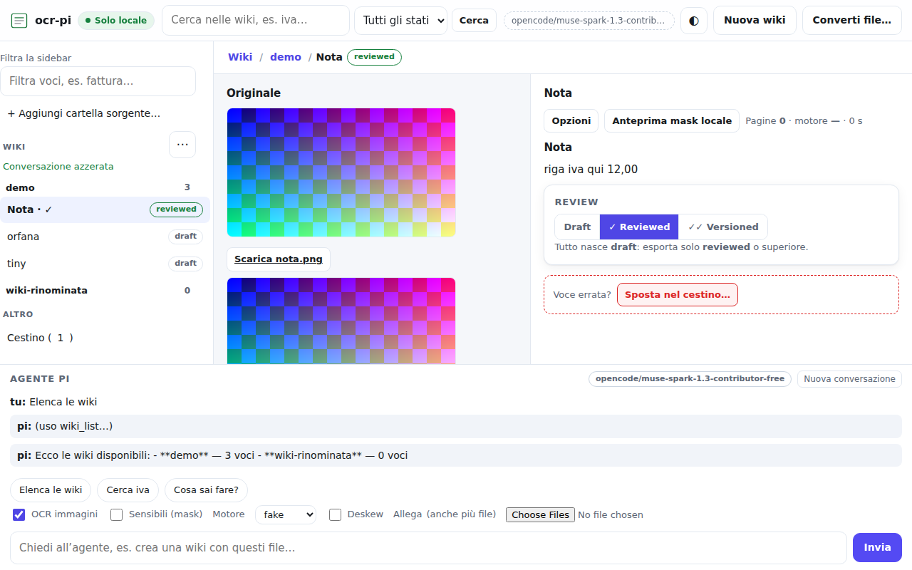
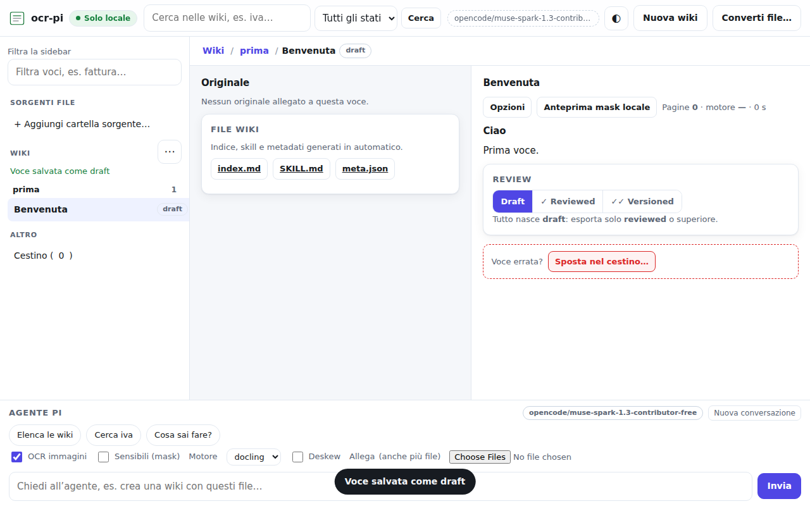
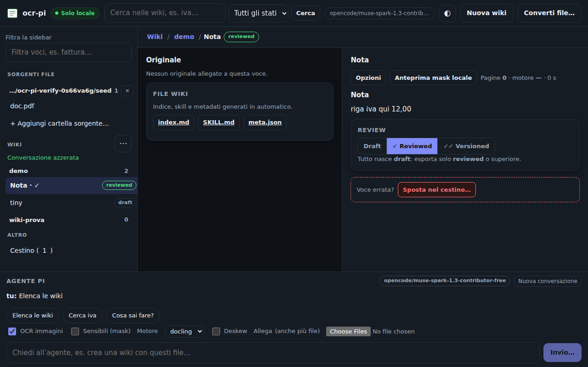
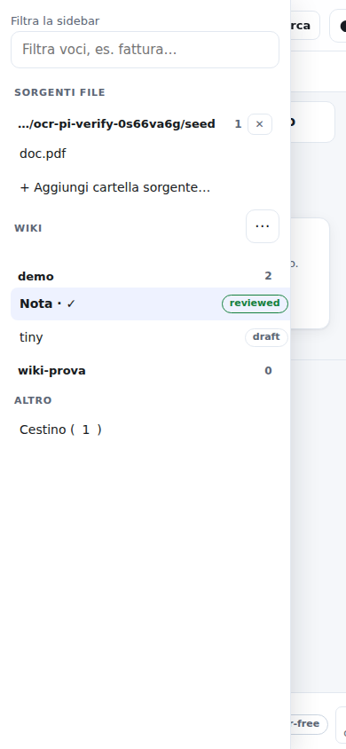

---

## 7. Se qualcosa non va

| Sintomo | Cosa fare |
|---|---|
| Prima conversione lentissima | Normale una volta sola (~2 min); poi secondi |
| `j-pii blocked ... review dismissed` | Rispondi al prompt invece di ignorarlo |
| `ocr-pi blocked ...` | Rispondi alle due domande e riprova |
| `salto ... (non è un'immagine valida)` | Controlla il file (non è PNG/JPEG/… leggibile) |
| Nativa non mascherabile (dock) | Attiva OCR per i sensibili, poi riprova |
| Dock muto (scrivi e non risponde) | Sidecar j-pii non partito: riavvia con `JPII_ANALYZER=fake` per provare, o `JPII_PYTHON=<venv>/bin/python` col setup completo; l'app ora lo scrive in chat invece di tacere |
| `Agent is already processing a prompt` | Un messaggio precedente era rimasto appeso: il server ora azzera e riprova da solo (vedi `[dock]` nel log). Se lo vedi spesso, alza `UI_CHAT_TIMEOUT_MS` o premi “Nuova conversazione” |
| Troppe revisioni | `JPII_EXCLUDE_TAGS=DATE,TIME,BUILDINGNUM,AGE` |
| `ModuleNotFoundError` | Usa il python del venv giusto |
| Porta occupata | `PORT=8002 ...` (la 8000 la usa spesso il mock) |

Log: `/tmp/ocr-pi-daemon.log`, `/tmp/jpii-payload.log` (con extension debug).

---

## 8. Tour dei test (per chi legge dopo)

Segui nell'ordine; ogni passo dice cosa aspettarti. Se qualcosa non torna,
fermati e confrontalo: i test sono la rete di sicurezza del progetto.

**Passo 1 — unit Python veloci** (30 s, niente modelli):

```bash
python3 -m unittest discover -s ocr-pi/tests -t . 2>&1 | tail -n 3
```

Atteso `OK` con qualche `skipped` (i test deskew vogliono opencv).

**Passo 2 — tutti nel venv** (dopo il capitolo 2):

```bash
ocr-pi/.venv/bin/python -m unittest discover -s ocr-pi/tests -t . 2>&1 | tail -n 3
```

Atteso `OK` con 1 solo skip. Se un deskew fallisce di poco sui gradi, è la
tolleranza tilt: segnalalo.

**Passo 3 — benchmark fake** (1 min, deterministico):

```bash
python3 bench/run.py --engine fake
```

Atteso `ok` su tutti, `em=16/16` sui sintetici, `SKIP` sui paper non scaricati,
`exit=0`, report in `bench/report/report.json` (ignorato da git).

**Passo 4 — benchmark Docling vero** (primi run ~2 min, poi veloce):

```bash
python3 bench/corpus/fetch.py                 # i 4 paper (una volta)
ocr-pi/.venv/bin/python bench/run.py --engine docling --include-warped
```

Leggi così: `em=16/16` = tabella perfetta; righe `warped:` = degrado su foto
storta (è normale che le tabelle complesse cedano: motiva il deskew); i paper
riportano solo tempi (niente ground-truth).

**Passo 5 — extension pi** (1 min):

```bash
cd extension && node --test 2>&1 | grep -E "^# (tests|pass|fail)" && npx tsc --noEmit && echo "tsc pulito"
```

Atteso zero `fail` + tsc silenzioso.

**Passo 6 — backend web** (1 min):

```bash
cd ui && node --test server.test.mjs dock.test.mjs 2>&1 | grep -E "^# (tests|pass|fail)"
```

Atteso `tests 20`, zero `fail`: statici + `dockform`, 404/traversal,
create/add/search/review, errori JSON, sources, convert fake via demone (con
asset inline), `convert-raw` da wiki, `GET /api/file` confinato a wiki e
sorgenti, dettaglio/file/export/rename, convert-upload, `chat/new`, guard
sensibile+nativa — più i nuovi `GET /api/config`, `GET /api/search`,
`GET /api/wiki/:slug/trash` e il CSS (con check che `index.html` esponga
`dockform`, `gsearch`, `dlg`, `toast`, `docknew`, `newwikibtn`, `themebtn`).
Niente LLM, niente modelli.

**Passo 6b — UI end-to-end con Playwright** (2 min, Chromium locale):

```bash
python3 scripts/verify-ui.py
```

Atteso `TUTTO OK — 25 passi`: il backend parte su porta effimera con
`UI_PYTHON=python3` e `JPII_ANALYZER=fake`, semina una wiki `demo`, poi
clicca davvero ogni funzione — voce, ricerca, mask + review a tre stati,
nuova voce (+ validazione), sorgente invalida, cestino + vista, nuova wiki,
rinomina, sorgenti, anteprima da sorgente (img + pdf), raw collegato e
orfano (converti + salva), export + import merge, upload `fake` → salva,
dock (chat con fumetto unico, OCR da allegato, guard sensibili), rimozione
sorgente e wiki (conferma errata + giusta), tema dark persistente + `Ctrl+K`
+ mobile, radice vuota (prima wiki + voce), blocco j-pii con motivo specifico
— con zero errori JS e zero API fallite oltre al 400 atteso della sorgente
invalida. Screenshot in `/tmp/ui-shots/` (copiati in `docs/shots/` per il
capitolo 6.3). Richiede solo `pip install playwright` + `playwright install
chromium` (oppure il Chrome già in `~/.cache/ms-playwright`).

**Passo 7 — dal vivo**: tour wiki (capitolo 5.2 su `/tmp/...`), MCP
`--selftest` + demo, hook in pi con immagine vera (capitolo 5.1, 3 min di
pazienza la prima volta), PWA su `PORT=8001`.

## 9. Scenario cfsens — chiaro in chat, codificato nel log

La prova che dimostra il principio del progetto: i valori veri non lasciano
mai il computer, all'LLM viaggiano solo segnaposto, tu li rivedi in chiaro.

**Preparazione** (una volta): crea la wiki `demo` con una voce `cfsens`
contenente CF veri in chiaro, telefoni e nomi. Esempio minimo:

```md
| ID | Nome e Cognome | Codice Fiscale | Telefono |
| --- | --- | --- | --- |
| 1 | Rossi Mario | RSSMRA80A01H501U | +39 333 1234567 |
| 2 | Bianchi Laura | BNCLRA85M52F205X | +39 347 9876543 |
```

**Passo 1 — seleziona la voce giusta.** Click su `cfsens` in sidebar.
A destra vedi l'highlight PII (`2 PII via fake`), a sinistra l'originale
accoppiato se c'è.

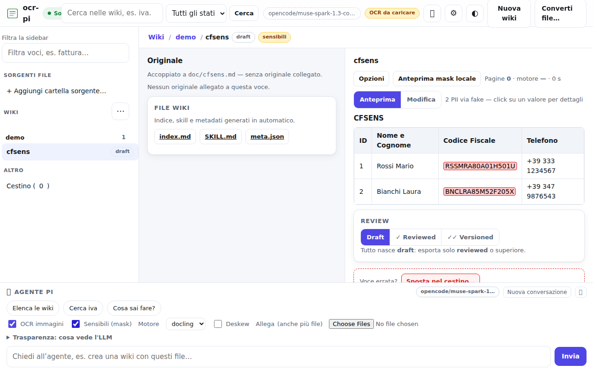

**Passo 2 — chiedi all'agente con mask attiva.** Nel dock spunta
`Sensibili (mask)`, premi `Nuova conversazione` per pulire contesto e
mapping vecchi, poi scrivi `leggi doc/cfsens.md e mostrami come tabella
markdown`. Atteso: 1 solo `(uso wiki_get…)` e tabella **formattata** con
CF, nomi e telefoni **in chiaro**.

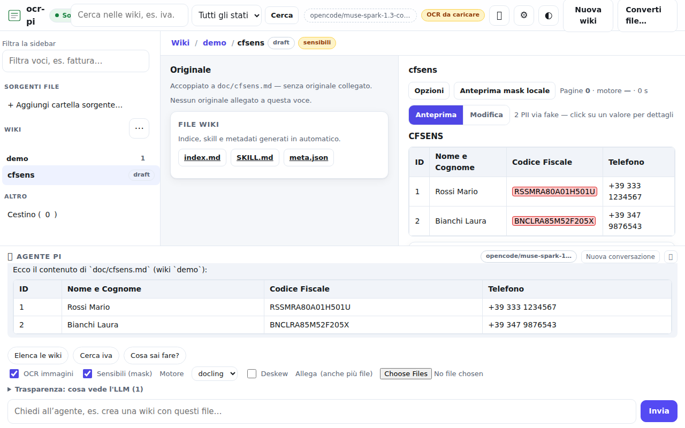

**Passo 3 — verifica cosa è partito.** Sotto il dock apri
`Trasparenza: cosa vede l'LLM` e premi `Aggiorna log`. Atteso: ultima riga
con `PII 2 via fake [CF_1] inviato codificato [CF_2] inviato codificato` e
`Inviati codificati 2 placeholder, vedi valori in chiaro in chat`. Nel log
mai valori veri, solo conteggi e segnaposto.

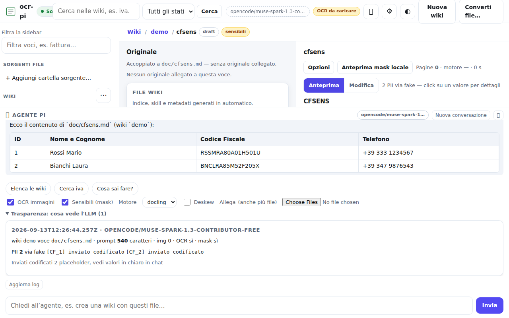

Se vedi ancora `[CF_1]` in chat: hai dimenticato `Nuova conversazione` o
`Sensibili (mask)`, oppure il contesto in alto dice un'altra voce
(es. `doc/testqqq.md`): riseleziona `cfsens` e ripeti dal passo 2.

Dettagli tecnici: `docs/research/`, `bench/corpus/`, `docs/agents/`, `docs/plans/`, `docs/shots/`, `scripts/verify-ui.py`, tracker GitHub.
